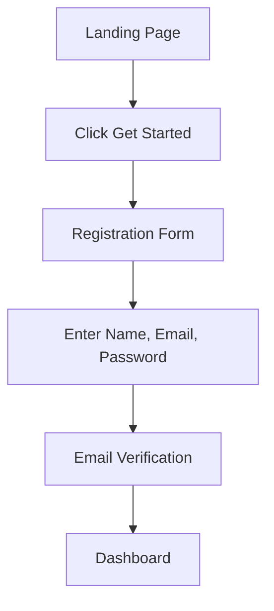
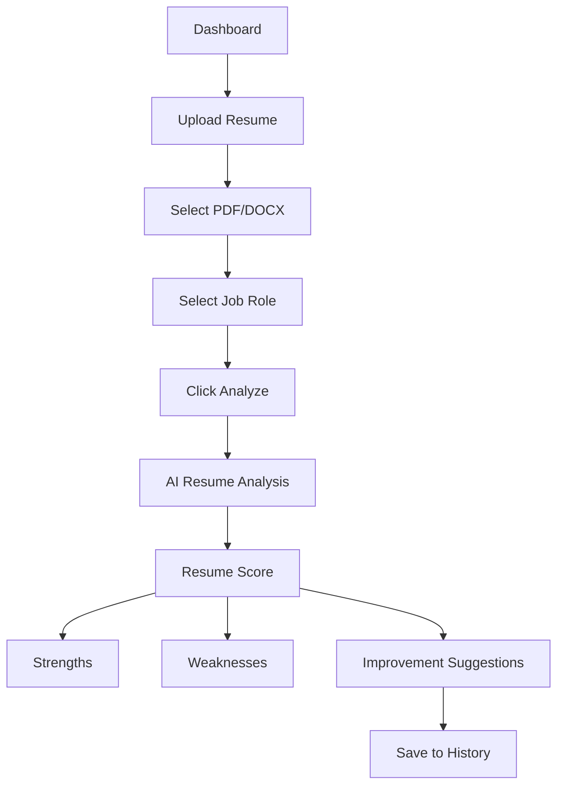
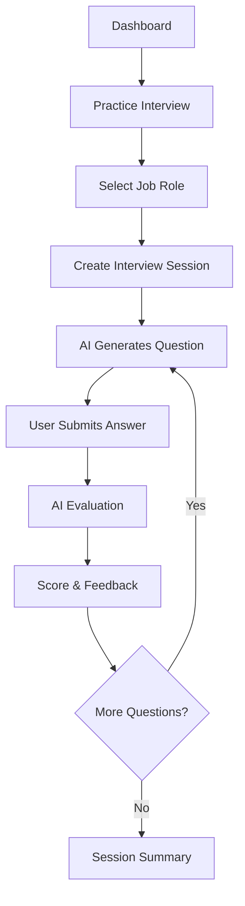
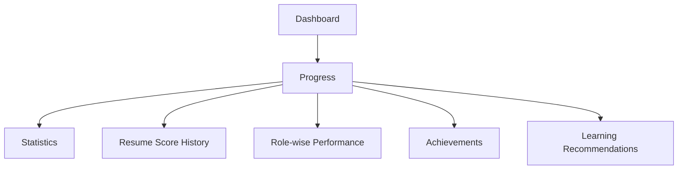
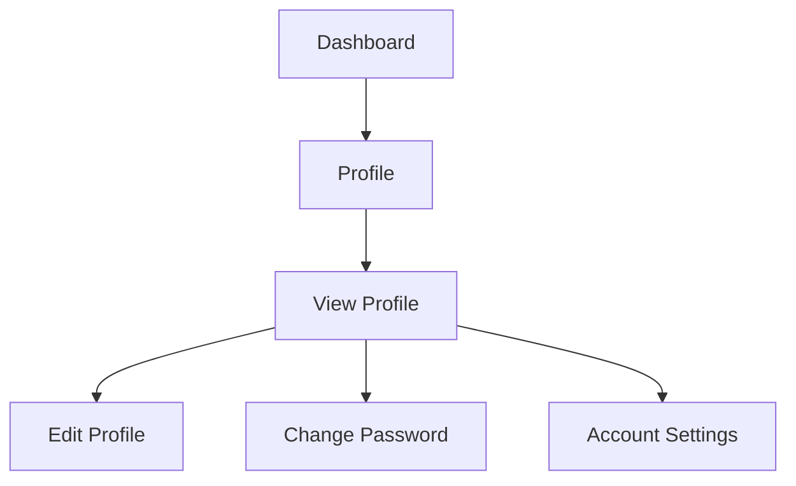
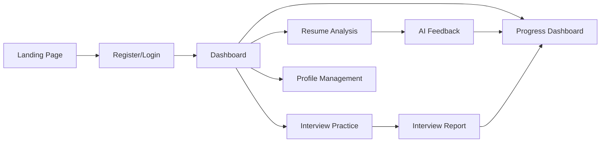

# User Flow Diagrams

## 1. User Registration Flow

---

## 2. Resume Scoring Flow

---

## 3. Interview Practice Flow

---

## 4. Progress Dashboard Flow

---

## 5. Profile Management Flow

---

# Complete User Journey

---

# Critical User Goals

- Register or log in within **60 seconds**.
- Upload a resume within **30 seconds**.
- Receive AI analysis within **15 seconds**.
- Practice AI interviews with instant feedback.
- Track long-term progress and performance.

---

# Potential User Drop-Off Points

| Stage | Potential Issue | Solution |
|--------|-----------------|----------|
| Registration | Too many fields | Keep only Name, Email, and Password |
| Resume Upload | Unsupported file format | Support PDF and DOCX with clear validation |
| AI Processing | Long waiting time | Display loading animation and progress indicator |
| Feedback | Difficult to understand | Use simple language and actionable suggestions |