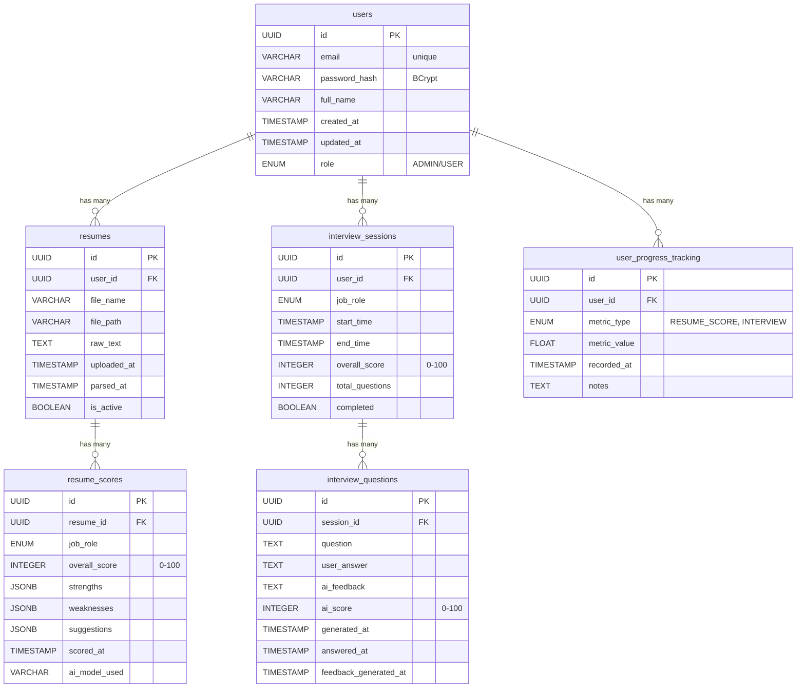

# Database Schema Design

## AI-Powered Career Coach Platform

### PostgreSQL 16

---

## 📊 Entity Relationship Diagram (ERD)


## 🔧 Complete SQL Schema

```sql
-- Enable UUID extension
CREATE EXTENSION IF NOT EXISTS "uuid-ossp";

-- ============================================
-- 1. USERS TABLE
-- ============================================
CREATE TABLE users (
    id UUID PRIMARY KEY DEFAULT uuid_generate_v4(),
    email VARCHAR(255) UNIQUE NOT NULL,
    password_hash VARCHAR(255) NOT NULL,
    full_name VARCHAR(100) NOT NULL,
    role VARCHAR(20) DEFAULT 'USER' CHECK (role IN ('USER', 'ADMIN')),
    created_at TIMESTAMP DEFAULT CURRENT_TIMESTAMP,
    updated_at TIMESTAMP DEFAULT CURRENT_TIMESTAMP
);

COMMENT ON TABLE users IS 'Stores user account information';
COMMENT ON COLUMN users.id IS 'Unique identifier (UUID)';
COMMENT ON COLUMN users.email IS 'User email address (unique)';
COMMENT ON COLUMN users.password_hash IS 'BCrypt encrypted password';
COMMENT ON COLUMN users.role IS 'User role: USER or ADMIN';

-- ============================================
-- 2. RESUMES TABLE
-- ============================================
CREATE TABLE resumes (
    id UUID PRIMARY KEY DEFAULT uuid_generate_v4(),
    user_id UUID NOT NULL REFERENCES users(id) ON DELETE CASCADE,
    file_name VARCHAR(255) NOT NULL,
    file_path VARCHAR(500) NOT NULL,
    raw_text TEXT,
    uploaded_at TIMESTAMP DEFAULT CURRENT_TIMESTAMP,
    parsed_at TIMESTAMP,
    is_active BOOLEAN DEFAULT TRUE,
    CONSTRAINT fk_user FOREIGN KEY (user_id) REFERENCES users(id)
);

COMMENT ON TABLE resumes IS 'Stores uploaded resume files';
COMMENT ON COLUMN resumes.file_path IS 'Storage path (local/S3)';
COMMENT ON COLUMN resumes.raw_text IS 'Extracted text for AI processing';
COMMENT ON COLUMN resumes.is_active IS 'Only one active resume per user';

-- ============================================
-- 3. RESUME SCORES TABLE
-- ============================================
CREATE TABLE resume_scores (
    id UUID PRIMARY KEY DEFAULT uuid_generate_v4(),
    resume_id UUID NOT NULL REFERENCES resumes(id) ON DELETE CASCADE,
    job_role VARCHAR(50) NOT NULL CHECK (job_role IN ('FRONTEND', 'BACKEND', 'DATA', 'UIUX')),
    overall_score INTEGER CHECK (overall_score >= 0 AND overall_score <= 100),
    strengths JSONB,
    weaknesses JSONB,
    suggestions JSONB,
    scored_at TIMESTAMP DEFAULT CURRENT_TIMESTAMP,
    ai_model_used VARCHAR(50),
    CONSTRAINT fk_resume FOREIGN KEY (resume_id) REFERENCES resumes(id)
);

COMMENT ON TABLE resume_scores IS 'AI-generated resume scores and feedback';
COMMENT ON COLUMN resume_scores.strengths IS 'JSON array of strengths';
COMMENT ON COLUMN resume_scores.weaknesses IS 'JSON array of weaknesses';
COMMENT ON COLUMN resume_scores.suggestions IS 'JSON array of improvement suggestions';
COMMENT ON COLUMN resume_scores.ai_model_used IS 'e.g., gpt-4o, gpt-3.5-turbo';

-- Indexes for performance
CREATE INDEX idx_resume_scores_resume_id ON resume_scores(resume_id);
CREATE INDEX idx_resume_scores_job_role ON resume_scores(job_role);
CREATE INDEX idx_resume_scores_scored_at ON resume_scores(scored_at);

-- ============================================
-- 4. INTERVIEW SESSIONS TABLE
-- ============================================
CREATE TABLE interview_sessions (
    id UUID PRIMARY KEY DEFAULT uuid_generate_v4(),
    user_id UUID NOT NULL REFERENCES users(id) ON DELETE CASCADE,
    job_role VARCHAR(50) NOT NULL CHECK (job_role IN ('FRONTEND', 'BACKEND', 'DATA', 'UIUX')),
    start_time TIMESTAMP DEFAULT CURRENT_TIMESTAMP,
    end_time TIMESTAMP,
    overall_score INTEGER CHECK (overall_score >= 0 AND overall_score <= 100),
    total_questions INTEGER DEFAULT 0,
    completed BOOLEAN DEFAULT FALSE,
    CONSTRAINT fk_user_session FOREIGN KEY (user_id) REFERENCES users(id)
);

COMMENT ON TABLE interview_sessions IS 'Stores interview practice sessions';
COMMENT ON COLUMN interview_sessions.overall_score IS 'Average score of all questions';
COMMENT ON COLUMN interview_sessions.completed IS 'Whether session was completed';

-- ============================================
-- 5. INTERVIEW QUESTIONS TABLE
-- ============================================
CREATE TABLE interview_questions (
    id UUID PRIMARY KEY DEFAULT uuid_generate_v4(),
    session_id UUID NOT NULL REFERENCES interview_sessions(id) ON DELETE CASCADE,
    question TEXT NOT NULL,
    user_answer TEXT,
    ai_feedback TEXT,
    ai_score INTEGER CHECK (ai_score >= 0 AND ai_score <= 100),
    generated_at TIMESTAMP DEFAULT CURRENT_TIMESTAMP,
    answered_at TIMESTAMP,
    feedback_generated_at TIMESTAMP,
    CONSTRAINT fk_session FOREIGN KEY (session_id) REFERENCES interview_sessions(id)
);

COMMENT ON TABLE interview_questions IS 'Individual questions in interview sessions';
COMMENT ON COLUMN interview_questions.question IS 'AI-generated question';
COMMENT ON COLUMN interview_questions.user_answer IS 'User submitted answer';
COMMENT ON COLUMN interview_questions.ai_feedback IS 'AI-generated feedback on answer';
COMMENT ON COLUMN interview_questions.ai_score IS 'Score for individual answer';

-- ============================================
-- 6. PROGRESS TRACKING TABLE
-- ============================================
CREATE TABLE user_progress_tracking (
    id UUID PRIMARY KEY DEFAULT uuid_generate_v4(),
    user_id UUID NOT NULL REFERENCES users(id) ON DELETE CASCADE,
    metric_type VARCHAR(50) NOT NULL CHECK (metric_type IN ('RESUME_SCORE', 'INTERVIEW_SCORE')),
    metric_value FLOAT,
    recorded_at TIMESTAMP DEFAULT CURRENT_TIMESTAMP,
    notes TEXT,
    CONSTRAINT fk_user_progress FOREIGN KEY (user_id) REFERENCES users(id)
);

COMMENT ON TABLE user_progress_tracking IS 'Historical progress data for charts';
COMMENT ON COLUMN user_progress_tracking.metric_type IS 'RESUME_SCORE or INTERVIEW_SCORE';
COMMENT ON COLUMN user_progress_tracking.notes IS 'Additional context (e.g., job role)';

-- Indexes for faster queries
CREATE INDEX idx_progress_user_id ON user_progress_tracking(user_id);
CREATE INDEX idx_progress_recorded_at ON user_progress_tracking(recorded_at);
CREATE INDEX idx_progress_metric_type ON user_progress_tracking(metric_type);

-- ============================================
-- 7. AUTO-UPDATE TIMESTAMP TRIGGER
-- ============================================
CREATE OR REPLACE FUNCTION update_updated_at_column()
RETURNS TRIGGER AS $$
BEGIN
    NEW.updated_at = CURRENT_TIMESTAMP;
    RETURN NEW;
END;
$$ language 'plpgsql';

CREATE TRIGGER update_users_updated_at BEFORE UPDATE ON users
FOR EACH ROW EXECUTE FUNCTION update_updated_at_column();
📋 Table Relationships Summary
Table	Foreign Key	References	Relationship
resumes	user_id	users.id	One-to-Many
resume_scores	resume_id	resumes.id	One-to-Many
interview_sessions	user_id	users.id	One-to-Many
interview_questions	session_id	interview_sessions.id	One-to-Many
user_progress_tracking	user_id	users.id	One-to-Many
🔑 Key Design Decisions
1. UUID Primary Keys
Why?

Distributed systems friendly

No sequential guessing vulnerabilities

Better for future microservices

No conflicts when merging databases

2. JSONB for AI Responses
Why?

AI returns variable-length lists

PostgreSQL can query JSONB directly

No need for separate tables

Flexible schema for future changes

Example JSONB Structure:
{
  "strengths": [
    "Strong Java fundamentals",
    "Good SQL knowledge",
    "REST API experience"
  ],
  "weaknesses": [
    "Missing microservices",
    "No cloud exposure"
  ],
  "suggestions": [
    "Add Spring Boot project",
    "Learn AWS basics"
  ]
}
3. On Delete Cascade
Why?

When user deletes account, all their data is removed

When resume is deleted, scores are removed

Clean data deletion

4. Enums for Job Roles
Why?

Data integrity

Only 4 allowed values

Easy to extend later

Better than free text

5. Indexes on Foreign Keys
Why?

Faster JOIN queries

Better performance for user-specific queries

Essential for dashboard queries

📊 Sample Data (For Testing)
-- Insert test user
INSERT INTO users (email, password_hash, full_name, role)
VALUES (
    'test@fast.edu.pk',
    '$2a$10$hashedpasswordhere',
    'Test User',
    'USER'
);

-- Insert sample resume
INSERT INTO resumes (user_id, file_name, file_path, raw_text)
VALUES (
    (SELECT id FROM users WHERE email = 'test@fast.edu.pk'),
    'Test_Resume.pdf',
    '/uploads/test_resume.pdf',
    'Experienced Java developer with 3 years of Spring Boot experience...'
);

-- Insert sample resume score
INSERT INTO resume_scores (resume_id, job_role, overall_score, strengths, weaknesses, suggestions)
VALUES (
    (SELECT id FROM resumes WHERE file_name = 'Test_Resume.pdf'),
    'BACKEND',
    72,
    '["Strong Java fundamentals", "Good SQL knowledge"]'::jsonb,
    '["Missing microservices experience", "No cloud platform exposure"]'::jsonb,
    '["Add Spring Boot + AWS project", "Include unit test examples"]'::jsonb
);

-- Insert sample interview session
INSERT INTO interview_sessions (user_id, job_role, overall_score, total_questions, completed)
VALUES (
    (SELECT id FROM users WHERE email = 'test@fast.edu.pk'),
    'BACKEND',
    85,
    10,
    TRUE
);

-- Insert sample interview question
INSERT INTO interview_questions (session_id, question, user_answer, ai_feedback, ai_score)
VALUES (
    (SELECT id FROM interview_sessions WHERE user_id = (SELECT id FROM users WHERE email = 'test@fast.edu.pk') LIMIT 1),
    'Explain the difference between @RestController and @Controller',
    '@RestController combines @Controller and @ResponseBody',
    'Excellent answer! You clearly understand the distinction.',
    85
);
🚀 Migration Strategy
Development
Run schema.sql on local PostgreSQL

Use ddl-auto: validate in Spring Boot

Manual schema changes via migration scripts

Production (Future)
Use Flyway or Liquibase

Version-controlled migrations

Rollback plans

📈 Performance Considerations
Indexes to Add (Future)
-- For dashboard queries
CREATE INDEX idx_resume_scores_user_role ON resume_scores(resume_id, job_role);

-- For search functionality
CREATE INDEX idx_resumes_raw_text ON resumes USING GIN(to_tsvector('english', raw_text));

-- For date range queries
CREATE INDEX idx_interview_sessions_user_date ON interview_sessions(user_id, start_time DESC);
